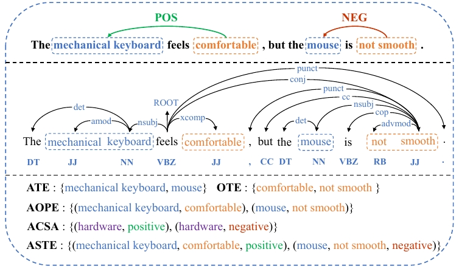
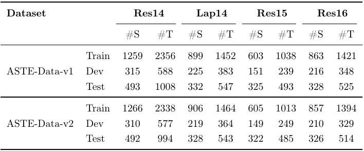
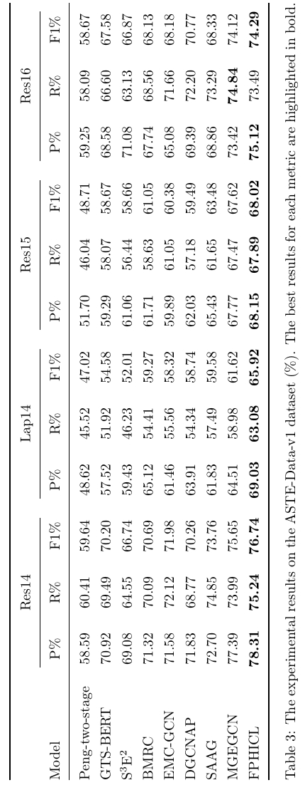
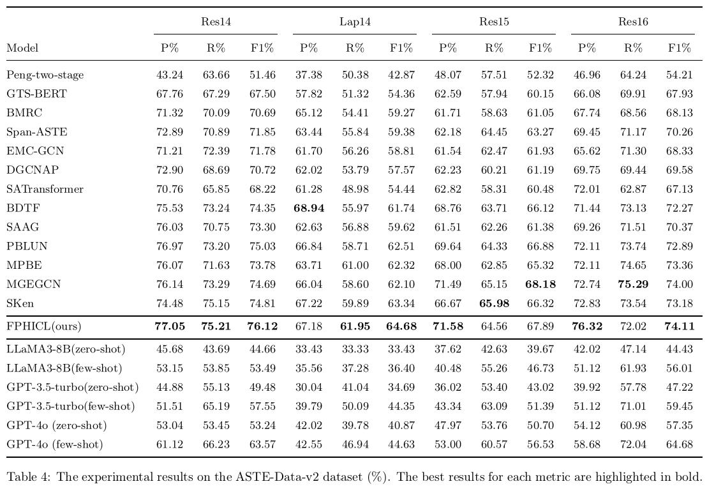

# FPHICL：Fine-grained Part-of-Speech and Hierarchical Interactive Contrastive Learning for Aspect Sentiment Triplet Extraction

## Introduction

Aspect Sentiment Triplet Extraction (ASTE) identifies aspect terms, opinion terms, and their sentiment polarities in 
text. Existing methods, relying on basic syntactic features and sentiment knowledge, often struggle with capturing 
sufficient sentiment information and face term extraction complexity. To overcome this, we propose a novel framework 
integrating fine-grained part-of-speech analysis and hierarchical interactive contrastive learning (HICL). 
This approach leverages richer linguistic features, establishes a triplet knowledge fusion mechanism, and enables
mutual interaction between sentiment elements for enhanced extraction.



## Experimentual Dataset



## Experimentual Result ASTE-DATA-V1
The main results of ASTE-DATA-V1 are listed in the table below. The detailed analysis is available in the paper.


## Experimentual Result ASTE-DATA-V2
The main results of ASTE-DATA-V2 are listed in the table below. The detailed analysis is available in the paper.


## Conda Configuration
In this section, we will give details on how to configure FPHICL conda virtual environment and give specific installation
instructions,  as shown below:
```sh
pip install transformers==4.18.0
pip install pytorch==1.12.0 (cu113)
pip install torchaudio ==0.12.0+cu113 
pip install torchvision==0.13.0+cu113 
pip install torchmetrics==0.7.0
pip install pytorch-lightning==1.3.5
pip install spacy==3.5.0
pip install nltk==3.7.0
pip install tqdm==4.66.5
...
```

## FPHICL Project Structure
### Model code section:
```
  code
   ├── utils
   ├── model
   ├── train
   ├── data
   ├── sengcn
   └── syngcn

```
### Dataset architecture
```
data
 └── V1
 |   ├── 14res
 |   |     ├── train.json
 |   |     ├── dev.json
 |   |     └── test.json
 |   ├── 14lap/...
 |   ├── 15res/...
 |   └── 16res/...
 └── V2
     ├── 14res
     |     ├── train.json
     |     ├── dev.json
     |     └── test.json
     ├── 14lap/...
     ├── 15res/...
     └── 16res/...

```
